# DownUnder CTF

**Website :** [DownUnderCTF](https://downunderctf.com/)


**Description :** DownUnderCTF is the largest online Australian run Capture The Flag (CTF) competition with over 4000+ registered users and over 2100+ registered teams (2021). Its main goal is to try to up-skill the next generation of potential Cyber Security Professionals and increase the CTF community's size here in Australia. Prizes are only for Australian Secondary or Tertiary school students. However, our CTF is online and open for anyone to play worldwide.

For this CTF, I participated in team with all of my collegues of my M2I class from the Friday, September 23 at 12 p.m to the Sunday, September 25 at 9:30 a.m.

## **Table of Contents**

1. Miscellaneous
   
   - [Discord](#Discord)
   - [Twitter](#Twitter)

2. Web
   
   - [Helicoptering](#Helicoptering)

3. OSINT
   
   - [Honk_Honk](#Honk_Honk)
   - [Bird’s_Eye_View_!](#Bird’s_Eye_View_!)
   - [Does_It_Fit_My_CTF_?](#Does_It_Fit_My_CTF_?)

4. DIFR
   
   - [Doxme](#Doxme)
   - [Shop-Setup&Disclaimer](#Shop-Setup&Disclaimer)
   - [Shop-Knock_Knock_Knock](#Shop-Knock_Knock_Knock)

5. Survey
   
   - [Survey](#Survey)

6. Certification
   
   - [CertOfDownUnderCTF](#CertOfDownUnderCTF)

## Discord


**Challenge Description :** Have you joined the [DUCTF Discord](https://duc.tf/discord) yet? There are some spicy memes, a certified memer has posted one that will give you a flag!

### Approach

So I was join the DUCTF discord and I found the flag in the memes channel.

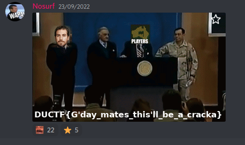

**Flag :** `DUCTF{G'day_mates_this'll_be_a_cracka}`

## Twitter


**Challenge Description:** O_O I spy with my little eye, the largest CTF in the southern hemisphere's twitter... O_O

### Approach

So I was going to the DownUnderCTF twitter and I found the flag in the bio.

**Flag :** `DUCTF{the-mascot-on-the-ductf-hoodie-is-named-ducky}`

## Helicoptering


**Challenge Description :** Is that an Apache I overheard ?
`http://34.87.217.252:30026/`

### Approach

Alright, so going to the link they give us we get this webpage.

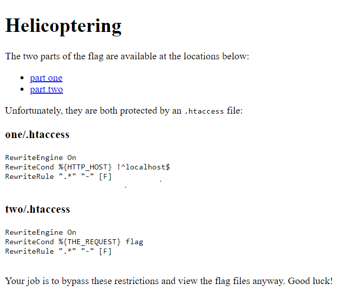

Now, the webpage tells us we need to access two directories

(1) [http://34.87.217.252:30026/one/flag.txt](http://34.87.217.252:30026/one/flag.txt)

(2) [http://34.87.217.252:30026/two/flag.txt](http://34.87.217.252:30026/two/flag.txt)

The webpage also gives us the content of the .htaccess files for both directories. If you're not familiar, a quick google search for .htaccess files will tell you its contents is used in apache to create custom configurations for specific directories.

So lets start with the first one :

```
one/.htaccess

RewriteEngine On
RewriteCond %{HTTP_HOST} !^localhost$
RewriteRule ".*" "-" [F]
```

Without knowing any of this syntax there's a few things I recognise. We've got a 'RewriteCond' which I assume is the condition it checks when we try to go to the directory, and inside that condition I see a bit of regex. That regex is `^localhost$`, the `^` denotes the beginning of a string and `$` denotes the end. That means the regex will only match strings that are exactly `localhost`. Alright, but what's that `%{HTTP_HOST}` thingo ? Well I just pasted that into google and found this stack exchange page :

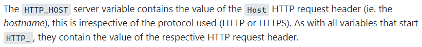

If that looks like a lot of random words, don't worry. We only need to focus on that very first sentence.

`The HTTP_HOST server variable contains the value of the Host HTTP request header`.

So when we send a request to a website our request looks something like this :

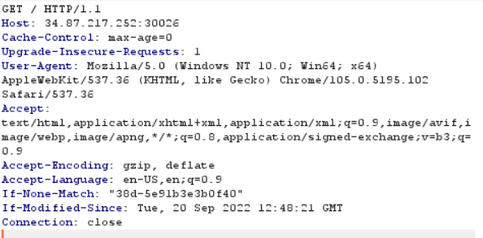

Notice those blue highlighted fields, they're the **request headers** that you sent to the server. Different headers are used in different contexts, you'll see the common ones a lot and some other ones less frequently, but there's plenty of documentation for them and you'll pick up the common ones pretty quick.

Anyway, we know from that stack exchange post that `%{HTTP_HOST}` holds the value of the `Host` header. We can actually see what that value was in my example above, in there the `Host` header was set to `34.87.217.252:30026`. So now the solution seems pretty obvious, we need to get our `Host` header to be `localhost` when we request `/one/flag.txt`.
Reflections
We can do this inside of burpsuite pretty easily, intercepting a request to `/one/flag.txt`, changing the `Host` header to equal `localhost` and sending it through. Making that change, our request then looks like this :

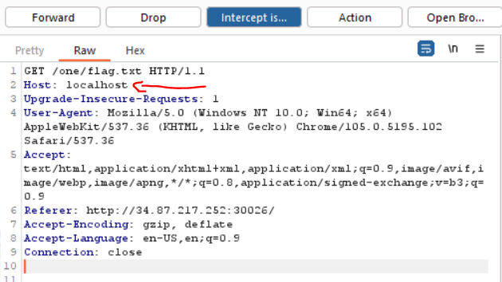

Sending it through and we get the first flag :

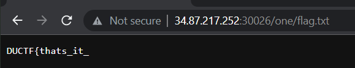

Awesome! Now let's take a look at the next one :

```
two/.htaccess

RewriteEngine On
RewriteCond %{THE_REQUEST} flag
RewriteRule ".*" "-" [F]
```

Alright, assuming the condition is in the same format as the last one then the condition is, `RewriteCond variable regex`. Where the regex should not match the variable. In this case the variable `%{THE_REQUEST}` refers to the request itself, so our request can't have flag in it at all.

So, a common way of bypassing filters like this is by using URL encoding. URL encoding is how URL's handle special characters, it helps with preventing special characters from causing problems. But URL encoding can be used on normal characters as well, and when the URL tries to resolve it will decode the URL encoding and search for the result.

So, in this case we can URL encode the string `flag.txt`. The URL encoded form looks like this :

`%66%6C%61%67%2E%74%78%74`

Putting that into our URL looks like this :

`http://34.87.217.252:30026/two/%66%6C%61%67%2E%74%78%74`

Awesome, now the only catch is that you have to send this request directly to the server. If you try putting it in your browser your browser will decode the text before it sends it. So the correct request in burpsuite looks like this :

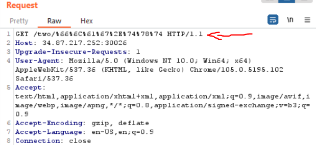

And we get the second part of our flag !

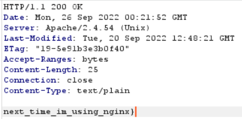

**Flag :** `DUCTF{thats_it_next_time_im_using_nginx}`

## Honk_Honk


**Challenge Description :** It definitely has something to do with vehicles. Since NoSurf points out that his rego is 23HONK, let’s try searching that up on Google.

### Approach

It definitely has something to do with vehicles. Since NoSurf points out that his rego is 23HONK, let’s try searching that up on Google.

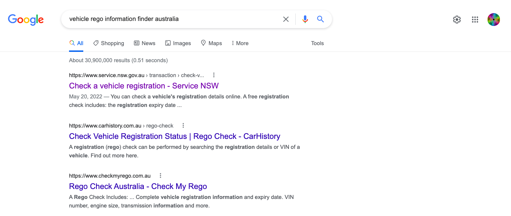

If I click on that and click on the “Check Online” button, it will bring me to a screen like this : 

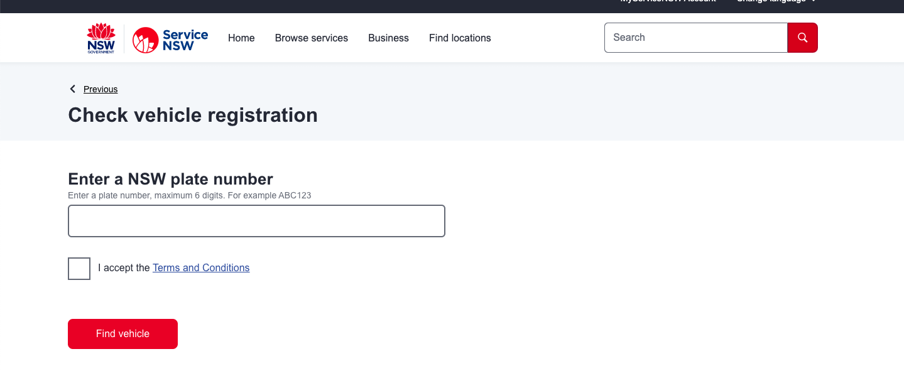

If I type in 23HONK, I get to this screen :

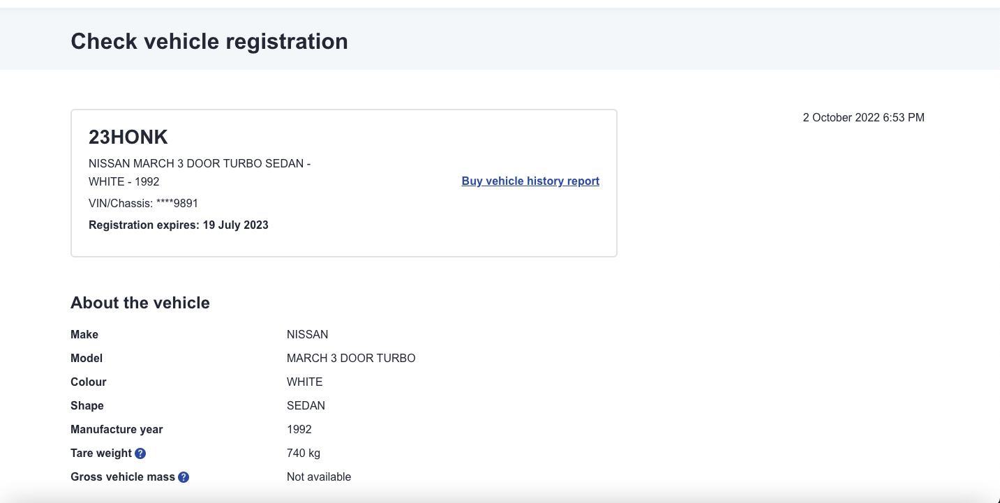

And there’s our flag !

**Flag :** `DUCTF{19/07/2023}`

## Bird’s_Eye_View_!


**Challenge Description :** What a nice spot to have a picnic, EXAMINE the image and discover where this was taken.

### Approach

So I was going to the DownUnderCTF twitter and I found the flag in the bio.

I know I need to find some kind of location. If I search up photo location finder on google, I will find a website that looks like this :

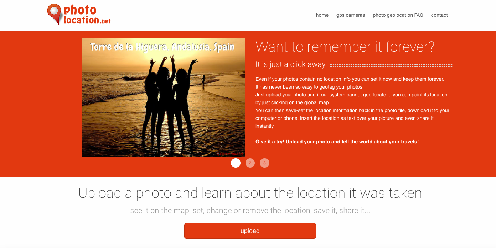

Here, I want to upload the file that they give and I get to this screen :

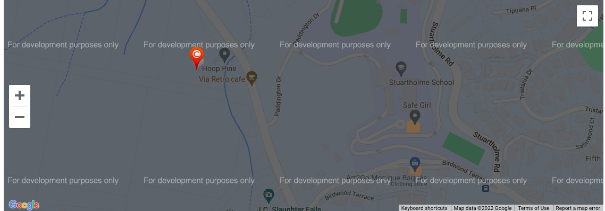

As I can see, this area is called Hoop Pine, and that is the flag !

### Reflections

Also there are GPS logs in the picture who can found the place of the view.

**Flag :** `DUCTF{HoopPine}`

## Does_It_Fit_My_CTF_?


**Challenge Description :** Cheers for that, I'm assuming you've worked out that I'm YouTuber... What's my channel name?
Note: This challenge assumes you have solved "Honk Honk" before attempting.

### Approach

To solve this challenge, I first have to solve Honk Honk, which I already solved. 

Try to search up 23HONK on Gogole and YouTube and eventually I’ll come across this video : 


The license plate is 23HONK, which means that this is NoSurf’s car. Therefore, this must be his channel.

**Flag :** `DUCTF{MightyCarMods}`

## Doxme


**Challenge Description :** Office is my safe word...

### Approach

At the first time, I was downloading the file of the challenge and I clicked on it. An archive manager was launched and I had folders in. 

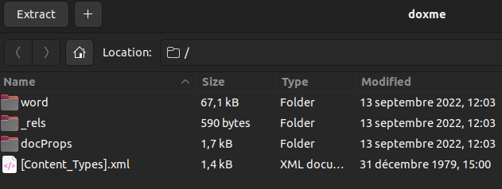

After navigation, I found 2 images who contain the flag in two parts.

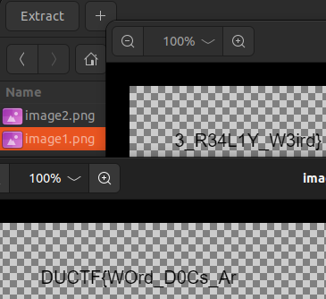

### Reflections

I don't think It was the classic way but it was really fast and easy as a result. 

**Flag :** `DUCTF{WOrd_D0Cs_Ar3_R34L1Y_W3ird}`

## Shop-Setup&Disclaimer


**Challenge Description :** Solving this challenge will unlock more "Shop- " challenges in the DFIR category.
All the "Shop- " challenges in the DFIR category use the same JSON data set (`DownUnderShop.JSON`) which can be downloaded from here.
We'd encourage you to use a log analytics tool such as Splunk (1 week free cloud trial) to assist with analysing the logs.
These logs and scenarios are designed to be real-ish, they're simpler and given that the entire data set covers 1hr all malicious activity is conducted on a condensed time frame.
The structure of the fake website being targeted is a basic online store with browsing, purchasing and account functionality.
Flag formats will not be in the standard `DUCTF{}` format.
THE FLAG FOR THIS CHALLENGE IS : `IAgreeToTheTeasAndTheSeas`.

### Approach

As you can see, this challenge is an explanation for the other `Shop` challenges. The is given.

**Flag :** `IAgreeToTheTeasAndTheSeas`

## Shop-Knock_Knock_Knock


**Challenge Description :** Looks like there's been a bruteforce/password spray attempt ouvez intégrer une image du pdf.against the website!
What's the contact email for the ISP of the attacker's IP?

### Approach

It talks about a bruteforce/password spray against the website. From a biased offensive mindset this is normally done via a post request. So I opened the JSON file and CTRL+F looking for a POST. Also bruteforce/password attacks spend very lot requests in low time. The first hit was for this IP: 58.164.62.91, doing a Whois shows that the ISP is Telstra and the email is `abuse@telstra.net`

**Flag :** `abuse@telstra.net`

## Survey


**Challenge Description:** Your feedback helps us to improve DUCTF each year. Please take the time to fill out the survey form and tell us what you thought about DUCTF 2022!
[**Link to survey**](https://forms.gle/P57Ngdk2CqnMSxJv8)

### Approach

So I was going to the Google Forms and I found the flag at the end.

**Flag :** `DUCTF{thx_4_playing_DUCTF_2022}`

## CertOfDownUnderCTF

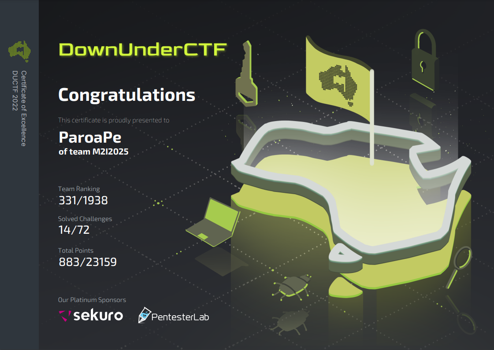