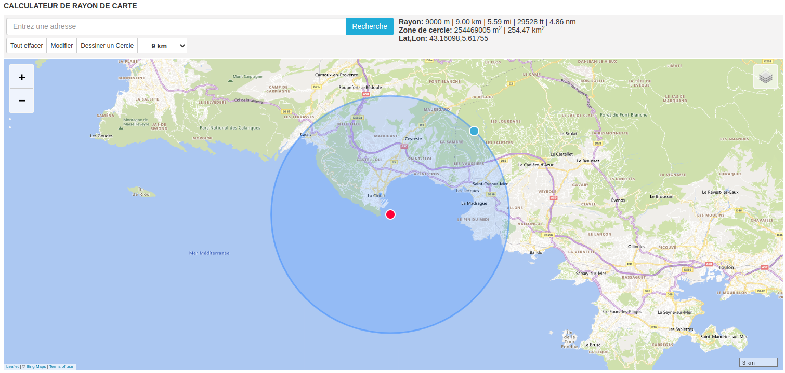
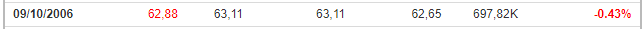

# HackInProvence CTF

**Website :** [HackInProvence](https://www.hackinprovence.fr/)

**Description :** Prepare your keyboards and your PCs, Hack In Provence organizes its 1st CTF open to all in person on December 3rd, all day, at "The Camp" in Aix en Provence. In partnership with Crosscall who will give away tablets and smartphones. We are waiting for many of you to compete in various and exciting challenges.

## **Table of Contents**

1. OSINT
    - [GEOINT](#GEOINT)
    - [A_vol_D'oiseau](#A_Vol_D'oiseau)
    - [Nom_De_Code](#Nom_De_Code)
    - [Tour_D'horizon](#Tour_D'horizon)
    - [Chronogeolocalistion](#Chronogeolocalistion)
    - [CAC40](#CAC40)
    - [ID](#ID)

2. RF
    - [Un_Bateau_Approche](#Un_Bateau_Approche)
    - [Un_Mysterieux_Conteneur](#Un_Mysterieux_Conteneur)

3. Crypto
    - [Decrypt_And_Tryhard](#Decrypt_And_Tryhard)

## GEOINT

**Challenge Description :** Locate the GPS coordinates of this place round to the hundredth.

### Approach

At the first time, I have downloaded the image and I launch a little research on google image but nothing was found. After that, I decide to download the image of the second challenge (I don't know why) and I see susecpt things (A lighthouse at the end of a dike). Something as like the first picture. And the description of the second challenge was `See around this place...` so the second picture was around the first.

I made the connection and went to google maps to see if `La Digue du Large` at La Ciotat was my place.

It was that, I found the exact location and the flag !

### Reflections

The second image was a mistake by the organisation, It is the response at the first and second OSINT challenge :)

**Flag :** `S3cSe4{43.169,5.615}`

## A_Vol_D'oiseau

**Challenge Description :** Near this place in March 2020, in a cove, a small boat was alone. As the crow flies, what is the distance between its bow and this place ?

### Approach

The response was in the picture so it was no difficult to find the flag.

**Flag :** `S3cSe4{1,18}`

## Nom_De_Code

**Challenge Description :** On the green island there are 2 forts. Destroyed during a bombing in August 44. One of them had a code name but which one ?

### Approach

Like as my habits, a little research on Google is required. In fact, it was a good idea because the flag was just on the 3rd link.
`Fort Saint Pierre` code name `STP MAL 044`

**Flag :** `S3cSe4{STP MAL 044}`

## Tour_D'horizon

**Challenge Description :** From this fort we can see many peaks, but there is one that is the place of RF transmission. It is located at 8.6 km.

### Approach

I remember a tool for the covid-19 that allowed me to calculate a radius to go outside. I decided to use it to give me an idea of where to look, but it didn't give me much informations.

I need a map of radio antennas and I found this site (`https://www.cartoradio.fr/`) which allows me to calculate a distance and find the exact names of what I am looking for !

**Flag :** `S3cSe4{Le Télégraphe}`

## Chronogeolocalistion

**Challenge Description :** Knowing that this photo was taken in early July. What time is it on the picture? The margin of error is 5min.

### Approach

After a research of the name seen on the picture `Aquilade 1`. I find that it is a shuttle between the old port of La Ciotat and the Green Island so let's find the boat with Google Street View.

On this picture I think we are around 12h-13h since the shadow of the sign is almost vertical, also, many people are on the terraces probably eating.
With a calculation of the trajectory of the sun (rise/set) by deduction we can think that it is 15h00.

**Flag :** `S3cSe4{15H00}`

## CAC40

**Challenge Description :** What was Pernod Ricard's share price at the opening on October 9, 2006 ?

### Approach

A Google search brings us to several sites that have listed the share price of Pernod Ricard. Some of the information is wrong but the one in the picture below is right.

**Flag :** `S3cSe4{63.11}`

## ID

**Challenge Description :** Find the twitter ID of Mr. Marquis Melville. Example flag: S3cSe4{XXXXXXXX} where X is a number.

### Approach

After finding the Twitter profile of Mr Marquis Melville (`@MelvilleMarquis`), I found a siet allowing me to transform a username into an ID.

**Flag :** `S3cSe4{1563086620412194818}`

## Un_Bateau_Approche

**Challenge Description :** Technologies/Techniques used (keywords): Rf, Transponder, Identification System

Mini Scenario: Our sentinels have detected a fairly large boat heading towards the Green Island, we have captured a radio signal from this boat and after decoding the raw data we have obtained this partial message:

18UG;P?P880Ie=DHdd0S@gwv0000,0*51
H09RFOm600000002l>l>l05'e770,0*39
H09RFOi<D=<D40000000000000,0*6F

What is certain is that this boat is not supposed to be here. Find the callsign of the boat and its GPS coordinates.

### Approach

This challenge was not easy since I have almost no knowledge of radio frequencies. After some research I realize that I have in front of me a part of an AIS (Automatic Identification System) message so I decide to look for a site to decode the message online. As indicated in the statement, the message is partial, I have to fill in the missing elements. The decoding site helps me to find the missing elements.

The decoding site helps me to find the missing elements.
Also I realized after a few failed attempts that I had to calculate the NMEA Checksum so I found a website to do it for me.

After some adjustments I finally have something !

I need to find the GPS location.

I just have to do the same thing for the callsign of the boat with the fragents of the challenge.

**Flag :** `SecSea{B4N4N4_43.16331_5.61564}`

## Un_Mysterieux_Conteneur

**Challenge Description :** Thanks to the deciphered communications (previous challenge), we learned that they were waiting for a large shipment of grenadine bottles, what we know for sure is that this shipment is valuable enough to be stored in a highly secured container that they stole from the Ministry of Defense.
One of the callers mentioned a wireless remote control to open the container but also simply to check if it is powered up. Our sentry teams were able to record a radio signal but it did not open the container, unfortunately they were unable to record the signal to open it...

### Approach

This challenge was about a brute forcing radio frequency signal. So, with the flipper zero and a custom firmware this task was not difficult. The dolphin takes care of everything :)

The physical container looked like this :

After brute force, this ticket came out of the box :

As we can see on the picture below, the objective was to decipher progressively several character strings with the same cipher algorithm (mono-alphabetic substitution) for find the flag.

**Flag :** `SecSea{M4st3r_0f_Fr3qu3ncy}`

## Decrypt_And_Tryhard

**Challenge Description :** N/A

### Approach

As we can see on the picture below, the objective was to decipher progressively several character strings with the same cipher algorithm (mono-alphabetic substitution) for find the flag.

**Flag :** `S3cSe4{mon_A1ph1b3t_vous_c0nn41ss3z}`