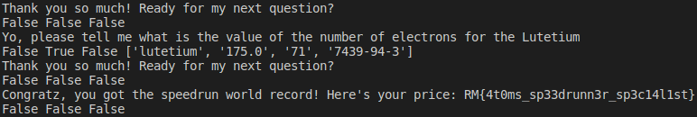
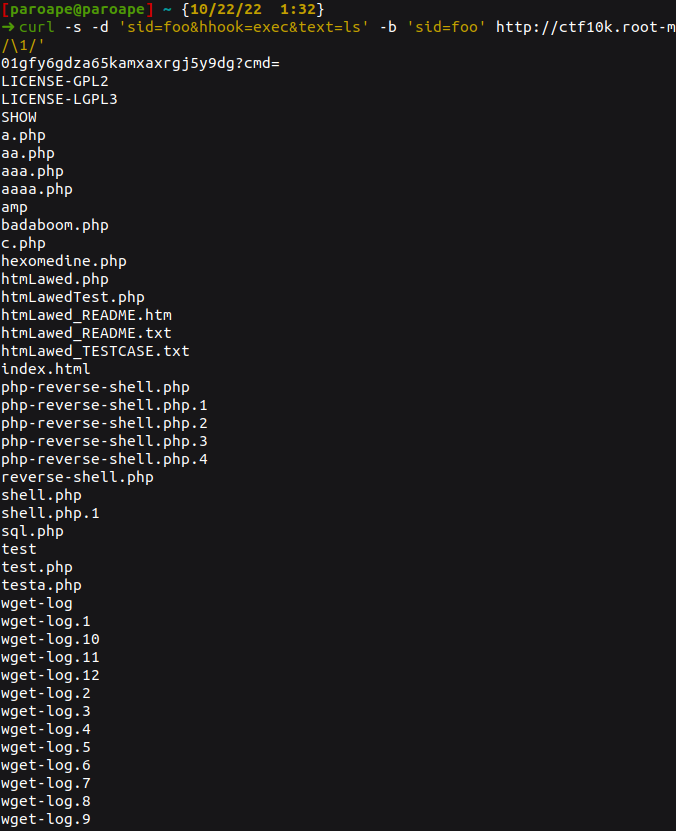

# RootMe CTF

**Website :** [RootMe](https://www.root-me.org/)

**Description :** At the occasion of 10K members on it Discord, RootMe make a CTF with many challenges and conferences.

## **Table of Contents**

1. Intro
    - [Auto_Travel](#Auto_Travel)
    - [Intercept_Me](#Intercept_Me)

2. OSINT
    - [Somewhere_In_France](#Somewhere_In_France)
    - [At_That_Time](#At_That_Time)
    - [Watch_Some_Movies_?](#Watch_Some_Movies_?)
    - [On_Holiday](#On_Holiday)

3. Crypto
    - [To_Crypt_Or_Not_To_Crypt](#To_Crypt_Or_Not_To_Crypt)

4. Programming
    - [RPN](#RPN)
    - [DFS](#DFS)
    - [Physics_Quizz_Speedrun](#Physics_Quizz_Speedrun)

5. Web
    - [GLPI-Me](#GLPI-Me)

## Auto_Travel

**Challenge Description :** Where are you going ?! 
[http://ctf10k.root-me.org:9001](http://ctf10k.root-me.org:9001/)

### Approach

In the first, I go to the link to just see and I'm directly redirecting on "Rick Astley - Never Gonna Give You Up" YouTube video. 
I think know the context of this challenge and I tell me, I can do a `curl` for see the page in html language.
`curl http://ctf10k.root-me.org:9001/`

Bingo ! I see the flag.

**Flag :** `RM{I_st0pp3d_b3f0r3_b31ng_r1ckr0ll3d}`

## Intercept_Me

**Challenge Description :** TLS ? Never heard of that before, sorry.

### Approach

I have an `.pcap` file with traffic, let's look at it.

I see a `.png` file who has been downloaded and I think remember I can download the file with wireshark ! Let's try it !

Yes, my intuitions are good, I go to click on the preview to see the .png file.

I got the flag, good challenge.

**Flag :** `RM{1nt3rc3pt10n_0f_1m4g3}`

## Somewhere_In_France

**Challenge Description :** Can you find this picture location ? We're looking for the name of the castle in lowercase and with _ instead of spaces.

### Approach

I had a picture in the challenge description and I directly push it on google image to see if I can have a response and the result was pretty good.

The flag is the name of the castle.

**Flag :** `RM{castle_roquetaillade}`

## At_That_Time

**Challenge Description :** I can't find this information but I need it to write a report to the administrators. How many challenges, virtual machines and solutions were there published on October 18, 2014 on the root-me platform.

### Approach

I already have a challenge like this in the DownUnderCTF. I can use the `wayback machine` for see the snapshot of RootMe at the 14 October 2014.

https://web.archive.org/web/20141018192412/https://www.root-me.org/

**Flag :** `RM{162_22_521}`

## Watch_Some_Movies_?

**Challenge Description :** This magnificent landscape was used during the shooting of a scene from a famous movie. But do you know the title of this film ?

### Approach

I had a picture in the challenge description and I directly push it on google image to see if I can have a response (like Somewhere_In_France challenge) and the result was pretty good.

**Flag :** `RM{the_return_of_the_king}`

## On_Holiday

**Challenge Description :** During my last days of holiday I took this picture. But when I got home, I couldn't remember the name of the road (or path) from which I took it. Could anyone help me please ?

### Approach

I had a picture in the challenge description and I directly push it on google image to see if I can have a response (like Somewhere_In_France and Watch_Some_Movies_? challenges) and the result was pretty good. In fact, many link bring back to Annecy Lake's.

After several searches around the lake, I find the right place and the name of the road from where the photo was taken!

**Flag :** `RM{promenade_des_seines}`

## To_Crypt_Or_Not_To_Crypt

**Challenge Description :** Your friend says he loves to 'encrypt' his passwords. Fearing that you might crack it, he has decided not to tell you the hash function he used! Find his password to punish him for hiding his passwords from you!

### Approach

I have Download the file attach with the challenge and I put it in `crack station` for crack the SHA-512 :

### Reflections
The tool `hashid` can be useful for analyse the hash.

**Flag :** `RM{p@ssw0rd!}`

## RPN

**Challenge Description :** Who needs parentheses when you can use Jan's RPN to get an unambiguous formula ?
`nc ctf10k.root-me.org 8002`

### Approach

Fun fact, this is the first CTF where I do programming challenges because my level was very bad, but now I work every day on python code and I have many TP about developments in Calais. So I decide to check programming challenges and there are affordable. 
This challenge need a connection to `netcat` and speak why machine to resolve RPN (calcul with Reverse Polish Notation). After many reflexions I had the flag.

[Code](Code/rpn.py)

**Flag :** `RM{Luk4s13w1cz_w0uld_b3_pr0ud}`

## DFS

**Challenge Description :** I need your help for this task! I have a few graphs and I need to know if I can access a node from another for every one of them.
`nc ctf10k.root-me.org 8001`

### Approach
Distributed File System is a new subjet for me and I do this challenge with   
classmate to understand these new concepts.

[Code](Code/dfs.py)

**Flag :** `RM{34sy_d3pth_f1rst_s3arch}`

## Physics_Quizz_Speedrun

**Challenge Description :** You found a super cool ranked quizz online about physics. It rewards anybody that can complete it faster than all of the predecessors.
`ws://ctf10k.root-me.org:8000`

### Approach
This challenge wad fun and learn how to use dictionnaries.

[Code](Code/physics_quizz_speedrun.py)

**Flag :** `RM{4t0ms_sp33drun3r_sp3c14l1st}`

## GLPI-Me

**Challenge Description :** The last CVE that made the business world shiver! Will you be able to exploit it?

### Approach

This challenge was not revolved but I want to speack about it. It was in relation with new CVE on GLPI and it was fun to check how they work.

An exploit can be found easly on internet : https://mayfly277.github.io/posts/GLPI-htmlawed-CVE-2022-35914/

We can just use curl with the vulnerable library (htmlawed) in GLPI and we got command injection.

Despite my attempts to try and explore the reverse-shells that I found on the machine, I was unable to find a way to access the server. I could have tried to enumerate the server by hand to find a flag but I didn't take the time.

**Flag :** `RM{NOT_FOUND}`
