# Shakti CTF

**Website :** [ShaktiCTF](https://shakti22.ctf.eng.run/dashboard)

**Description :** ShaktiCTF is a Jeopardy style online Capture The Flag competition. It's a beginner friendly CTF. It's main goal is to make more women interested in the field and expand the CTF community in India. It is part of the ShaktiCon conference.

## **Table of Contents**

1. Web
    - [Be_Alert](#Be_Alert)
    - [L0g1n_F4il3d](#L0g1n_F4il3d)

2. Crypto
    - [Eazy_peaZy](#Eazy_peaZy)

3. Reverse
    - [Love_Calculator](#Love_Calculator)

## Be_Alert

**Challenge Description :** Look everywhere to get the flag.

### Approach

From the description, I think that the flag must only be hidden in the source code of the website. While inspecting the source code I see a comment indicating a page of the site: `/flag.html`.

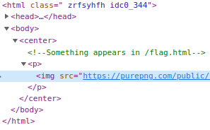

On my way to this famous page, I came across a form for a password. I look at the source code of the page and find some javascript code.

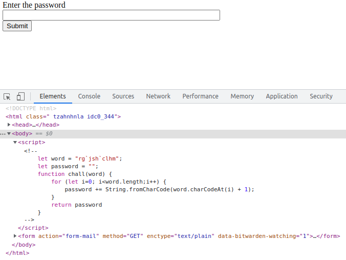

I say to myself that I can try to create my own html page and insert the same JS code to see the result of the `chall` function.

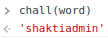

Cool ! I found the password expected by the challenge form.
And there is the flag :)

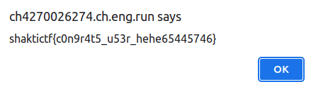

**Flag :** `shaktictf{c0n9r4t5_u53r_hehe65445746}`

## L0g1n_F4il3d

**Challenge Description :** I made my first ever login page! .Try to login.

### Approach

With this type of challenge description I can expect anything. So I ran an sql injection with the classisk `' OR 1 --` (The apostrophe indicates the end of the user's input field, the code ``or 1'' asks the script if 1 is true, and it always is, and -- indicates the beginning of a comment).

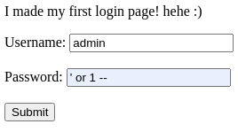

And here is that the flag appears before my eyes !

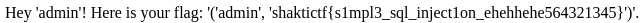

**Flag :** `shaktictf{s1mpl3_sql_inject1on_ehehhehe564321345}`

## Eazy_peaZy

**Challenge Description :** Who knew encryption could be so simple ?

### Approach

Here, I had an attachment with the challenge that included a piece of code in python :

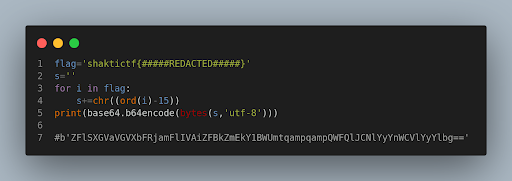

I took the result that is already printed in the code in comment and I put it in an online deciphering tool :

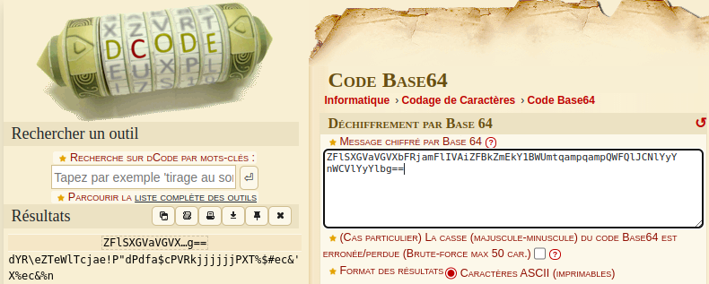

After a first decryption in `base64` (remarkable with its == at the end) and a second one in `ASCII shift` (+113), I get the coveted flag :

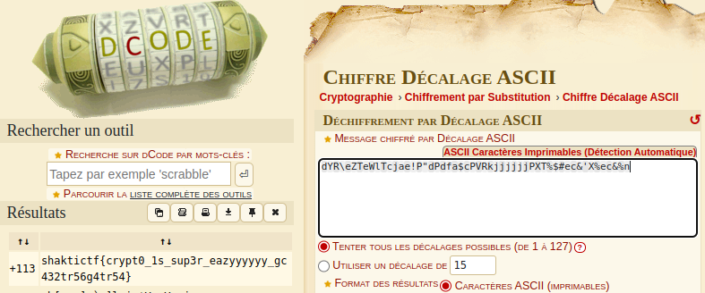

**Flag :** `shaktictf{crypt0_1s_sup3r_eazyyyyyy_gc432tr56g4tr54}`

## Love_Calculator

**Challenge Description :** Here is something you always wanted to stumble upon, A Love calculator...Go on and check your luck.

### Approach

This challenge was not finished but I enjoyed it because it was a discovery for me in terms of `reverse engineering`. It allowed me to discover several important notions in this category. I could also do 2 `RootMe` challenges in the Cracking part thanks to the knowledge acquired during the weekend.

The first step was for me to execute the binary to see its features but also to make a `string` which allows to have a lot of interesting information and one line which includes the flag but with a `%s` variable that I had to find.

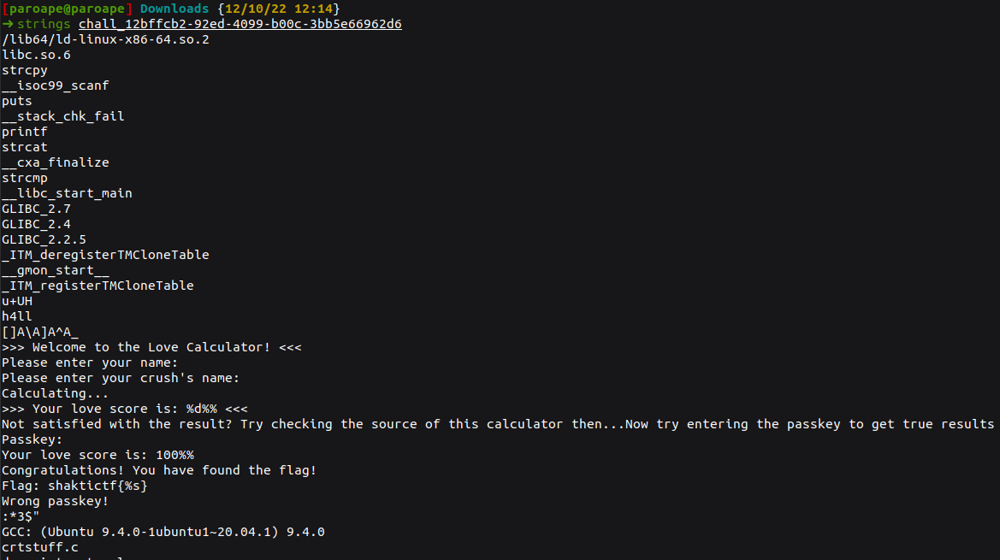

Despite my research on `radare2` or `Ghidra`, I lacked much knowledge.

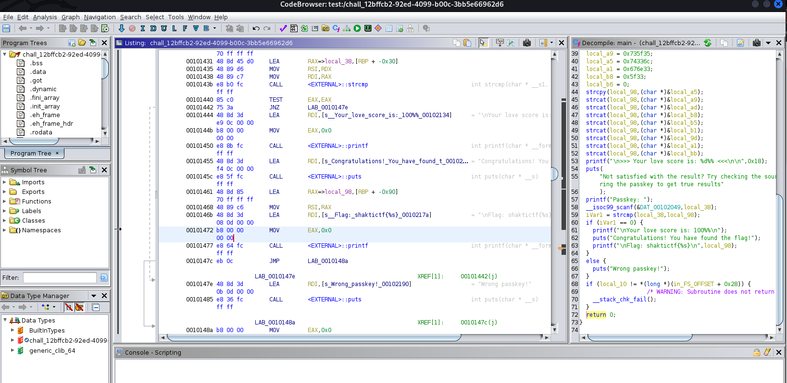

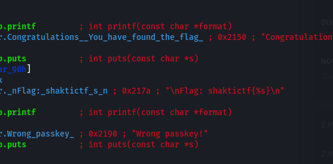

**Flag :** `N/A`