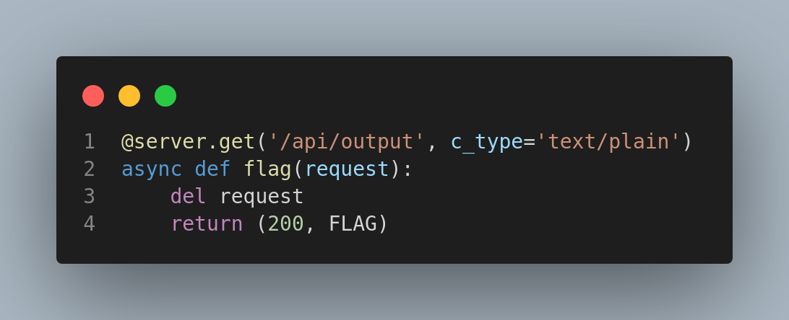
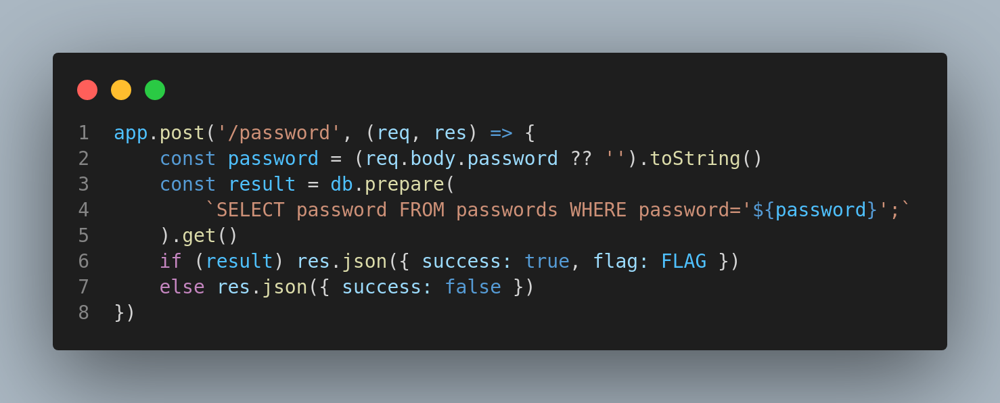
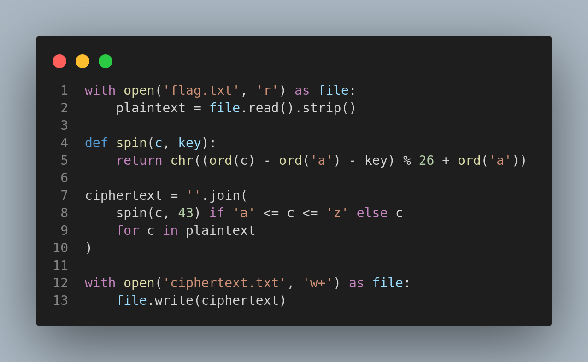

# Wreck CTF

**Website :** [WreckCTF](https://wreckctf.com/)

**Description :** Every year, the GreyHat cybersecurity club hosts an educational capture-the-flag competition to help college students around the world build cybersecurity skills. The competition features a number of intentionally vulnerable websites, insecure cryptographic schemes, exploitable binaries, unsafe machine learning models, and more. The full competition runs online from Sept 30 to Oct 2 (2022) and is open to everyone (college students, high school students, and security enthusiasts). We’ll have problems that are interesting to both beginners and advanced students.

For this CTF, I participated (alone) from the opening on Friday, September 30 at 10 p.m and I stopped 2-3 hours later.

## **Table of Contents**

1. Miscellaneous
    - [Discord](#Discord)
    - [Smoke-check](#Smoke-check)
    - [Bash](#Bash)

2. Web
    - [Sources](#Sources)
    - [Password-1](#Password-1)
    - [Password-2](#Password-2)
    - [Notes-1](#Notes-1)

3. Crypto
    - [Spin](#Spin)

## Discord

**Challenge Description :** This challenge is just for join the Discord and catch the flag on the "Annoucement" Channel.

### Approach

So I was join the WRECKCTF discord and I found the flag.

****

**Flag :** `flag{this_is_the_discord_flag}`

## Smoke-check

**Challenge Description:** What's in the `flag.txt` ?

### Approach

I read the file `flag.txt` and i found the flag (very difficult !).

****

**Flag :** `flag{this_is_what_flags_look_like}`

## Bash

**Challenge Description :** I guess it's probably dash, not bash. can you read the flag ?
`nc challs.wreckctf.com 31106`

### Approach

I was try the netcat connection and I type many commands like `ls`, after that I was sure of the bash shell because I was in possibility to list files and read `flag.txt`.

**Flag :** `flag{cat_the_flag}`

## Sources

**Challenge Description :** Click to spin, search for the flag !
`sources.challs.wreckctf.com`

### Approach

I know this challenges and I have directely check they web sources, here we have different parts of the flag in differents files.

****
****
****

### Reflections

**Check always** page source and scripts sources with navigators inspect tools.

## Password-1

**Challenge Description :** Can you figure out how to log in ?
`https://password-1.challs.wreckctf.com`

### Approach

In this challenge, we have the code source of the site and I see somewhere in the code (picture) an link to `/api/output` and this link call function who lunck a request to `flag`. So I decide to check this link and I found the flag.

****

**Falg :** `flag{why_is_hashing_in_browser_so_hard}`

## Password-2

**Challenge Description :** Okay, i fixed that. can you still log in?
`password-2.challs.wreckctf.com`

### Approach

This challenge is like the Web/Password-1, I have the source code of the website. I look it and I see an simple SQL command in the code, so i decide to launch an easy SQL injection with `' OR '1'='1` who work and let me see the flag.

****

**Flag :** `flag{i_love_in_memery_sqlite}`

### Reflections

Adding `'OR'1'='1`, which is a true statement, all passwords are returned.

## Notes-1

**Challenge Description :** Can you read the admin's note ?
`https://notes-1.challs.wreckctf.com`

### Approach

I decide to test in first the functionnatilies. I create many notes and i see the url, It change. In second time, I look the code and I see the id of notes is encode in `sha256`. So I took an `sha256` and I was decoding it. In fact, the note id is just a number who incremental one to one. After that I encode 0 in `sha256` and i was putting it in the url and I had the flag !
Also I tried to `-1` but I had no results.

****
****
****

**Flag :** `flag{technically_a_vulnerability}`

## Spin

**Challenge Description :** The classics.
`oujp{xkurpjcxah_ljnbja_lryqna}`

### Approach

For this challenge, I have read the code who is given (picture) and directly I recognized the cesar method for cipher a text (view in classes !). Good, I can use the code creates in classes for bruteforce and decrypt the potentially Cesar cipher text.

**Flag :** `flag{obligatory_caesar_cipher}`
